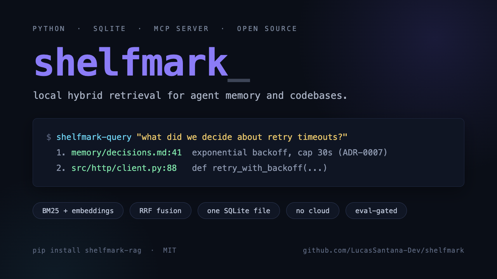

# shelfmark

[](LICENSE)
[](https://github.com/LucasSantana-Dev/shelfmark/stargazers)
[](https://modelcontextprotocol.io)



Local hybrid retrieval for agent memory and codebases. One SQLite file, no
services, no cloud. BM25 + dense embeddings fused with Reciprocal Rank Fusion,
an optional cross-encoder reranker, and an MCP server so coding agents
(Claude Code, Codex, anything MCP) can recall your notes, decisions, docs, and
code instead of guessing.

A shelfmark is the code a librarian writes on a book so it can be found again.
That is the whole product: before your agent answers, the librarian fetches the
handful of notes and code chunks most likely to matter and puts them on the
desk.

**[Why this exists](#why-this-exists)** · **[Quickstart](#quickstart)** ·
**[MCP server](#mcp-server-agent-integration)** ·
**[What gets indexed](#what-gets-indexed)** · **[Evaluation](#evaluation)** ·
**[How it compares](#how-it-compares)** · **[Configuration](#configuration)**

## Why this exists

Agent harnesses accumulate knowledge: memory notes, ADRs, plans, standards,
handoffs, and the code itself. The useful answer to most questions is already
written down somewhere. shelfmark indexes all of it into one local SQLite file
and answers "what did we decide about X / where did we handle Y" in a single
query, with `path:line` citations.

shelfmark is the retrieval engine that came out of a year of running AI coding
agents daily — most recently distilled from
[forgekit](https://github.com/LucasSantana-Dev/forgekit), an AI dev toolkit for
coding agents. Every design choice below was forced by a real failure mode in
that daily use, not picked off a paper.

Design choices that fell out of a year of measured iteration (see
`eval/holdout-policy.md` and inline rationale comments):

- **Hybrid by default.** BM25 catches identifiers and exact terms; embeddings
  catch paraphrase. RRF fusion beats either alone on mixed corpora.
- **Code-aware tokenization.** camelCase/snake_case sub-tokens on both corpus
  and query sides ("create player" matches `createPlayer`). Measured +2.8pp
  code / +3.2pp overall.
- **Symbol-definition boost.** Chunks whose defined symbol matches a query
  identifier get a rank-0 signal (+2.8pp code, zero regressions).
- **Selective reranking.** Cross-encoder rerank helps code and standards,
  *hurts* memory recall (measured -10.5pp). The rerank policy is scope-aware;
  memory is never reranked.
- **Contextual chunk prefixes.** Every chunk embeds with a
  `type | repo | file | symbol` header, not raw text.
- **Freshness without wall-clock.** Optional recency prior for memory scope,
  deterministic (reference = max mtime among candidates), so evals stay
  reproducible.

## Quickstart

```bash
pip install shelfmark-rag   # or: pipx install shelfmark-rag

shelfmark-build      # first run writes a starter ~/.shelfmark/sources.yaml — edit it, then rerun
shelfmark-query "how do we handle retry timeouts"
```

First build downloads `intfloat/multilingual-e5-small` (~120MB). Everything
after that runs offline.

<details>
<summary>Prefer a local checkout instead? (contributing, editing the source)</summary>

```bash
git clone https://github.com/LucasSantana-Dev/shelfmark && cd shelfmark
python3 -m venv venv && venv/bin/pip install -e .

venv/bin/shelfmark-build
venv/bin/shelfmark-query "how do we handle retry timeouts"
```

</details>

## MCP server (agent integration)

```jsonc
// e.g. Claude Code: .mcp.json or ~/.claude.json
{
  "mcpServers": {
    "shelfmark": {
      "command": "shelfmark-mcp"
    }
  }
}
```

(Local checkout instead of `pipx install`? Use `"command": "/path/to/shelfmark/venv/bin/shelfmark-mcp"`.)

Two tools:

- `rag_query` — full-corpus hybrid search (code, docs, commits, notes).
  Auto-scopes to the repo your agent is working in.
- `search_knowledge` — cross-project search over durable knowledge only
  (memory/standards/plans/handoffs/adrs; configurable via
  `RAG_KNOWLEDGE_SCOPE`). Never reranked, by measurement.

`examples/claude-code/` has the full loop: auto-recall on every prompt
(UserPromptSubmit), incremental reindex on file writes (PostToolUse), drift
reindex + weekly report at session start, and a nightly rebuild with an eval
regression gate.

## What gets indexed

`sources.yaml` declares everything (see `sources.yaml.example`):

| kind | what |
|------|------|
| `repos` | source code (py/ts/js/sh, symbol-aware chunking), `docs/**`, README, CHANGELOG, `docs/specs/**`, roadmap, last 180d of commit messages |
| `sources` | arbitrary markdown globs, each under a free `type` label you filter on at query time |
| `code_globs` | loose scripts outside any repo |

Incremental reindex (`indexer.py --incremental <files>`) keeps writes cheap;
`session_chunker.py` can additionally index agent session transcripts.

## Evaluation

The eval harness is the part most RAG setups skip. `eval/run.py` scores
Hit@1/3/5 + MRR per scope against a JSONL dataset; `eval/check.sh` gates any
change at >5pp regression vs a frozen baseline; `eval/holdout-policy.md`
documents the train/holdout discipline (the holdout set is never used for
tuning — numbers quoted from it are honest).

This repo ships a public, reproducible dataset (`eval/dataset-public.jsonl`)
whose queries target this repository's own code and docs:

```bash
venv/bin/python indexer.py                 # index this repo (sources.yaml.example works as-is)
venv/bin/python eval/run.py --dataset eval/dataset-public.jsonl --label mine
```

Benchmark results and methodology: [BENCHMARK.md](BENCHMARK.md).

To evaluate on YOUR corpus, write ~50 `{"query", "expect_path_contains",
"expect_scope"}` lines, freeze a fifth of them as holdout, and wire
`eval/check.sh` into your nightly rebuild. That regression gate is what keeps
retrieval quality from silently rotting as the corpus grows.

## How it compares

No cross-tool benchmark exists yet (see [Methodology & honest
limitations](BENCHMARK.md#methodology--honest-limitations) — we'd genuinely
like to see one run). Qualitative trade-offs, no fabricated numbers:

| Option | When to pick shelfmark instead | Why |
|---|---|---|
| **mem0** (managed, cloud-first memory layer) | You want full local data ownership and cross-repo search | One SQLite file, zero setup, MCP native. mem0 adds a hosted service you may not need |
| **Letta / MemGPT** (stateful agent framework) | You want a retriever, not a framework | Standalone tool that plugs into any MCP client; Letta expects you to adopt its agent runtime |
| **Zep** (hosted conversation memory) | You want permanent, local, cross-repo recall, not just chat threads | Single machine, no hosted dependency; Zep targets conversation history, not code/docs |
| **Cursor / Continue / Cody built-in indexing** | You want search outside one editor, or from a non-IDE agent | Runs anywhere MCP runs; editor-built-in indexes don't leave the editor |
| **DIY LangChain + Chroma/Weaviate** | You want hybrid retrieval and an eval gate without wiring it yourself | Reranking, RRF fusion, and `eval/check.sh` regression gates ship in the box |
| **Claude Code's built-in project memory** | You want hybrid (lexical + semantic) search across repos, not one workspace | File-based single-workspace memory has no ranking and no cross-repo scope |
| **Chroma / Weaviate raw, or Pinecone** (no framework) | You want zero infrastructure to stand up | One SQLite file vs. a vector DB service + embedding pipeline + glue code |
| **grep / ripgrep** | You need paraphrase recall, not just exact substrings | Lexical-only; shelfmark fuses BM25 with embeddings so "retry timeout" also matches "backoff on failure" |

Pick a hosted vector DB when you need multi-tenant scale across millions of
documents — that's a different problem than agent recall over your own repos.

Want to measure and improve retrieval ranking quality on your own pipeline,
independent of any specific agent? [hitgate](https://github.com/LucasSantana-Dev/hitgate)
provides label-free regression testing for hybrid retrievers. shelfmark and
hitgate share a common hybrid-retrieval foundation (BM25 + embeddings + RRF)
but serve complementary use cases: shelfmark for zero-setup agent memory with
MCP integration, hitgate for ranking evaluation and quality gates on any
retriever you already have.

## Configuration

All optional — see `.env.example` for the full list. Highlights:

| var | default | effect |
|-----|---------|--------|
| `RAG_HOME` | `~/.shelfmark` | data dir (index, sources.yaml) |
| `RAG_MODEL` / `RAG_DIM` | e5-small / 384 | embedding model |
| `RAG_BM25_WEIGHT` | 1.5 | >1 favors lexical match |
| `RAG_RERANK_AUTO` | on | rerank weak/ambiguous queries |
| `RAG_CODE_RERANK` | off | bge-reranker-v2-m3 for code scopes (+4.9pp, ~2.2GB) |
| `RAG_QLOG` | off | local query telemetry (powers `report.py`) |

## Contributing

Issues and PRs welcome — especially a real cross-tool benchmark (see [How it
compares](#how-it-compares)), support for more embedding models, or
non-Claude MCP client examples. If shelfmark saves your agent a guess, a star
helps others find it.

## License

MIT
